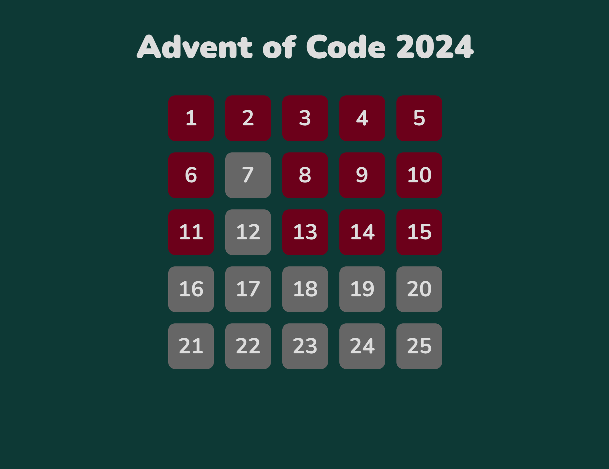
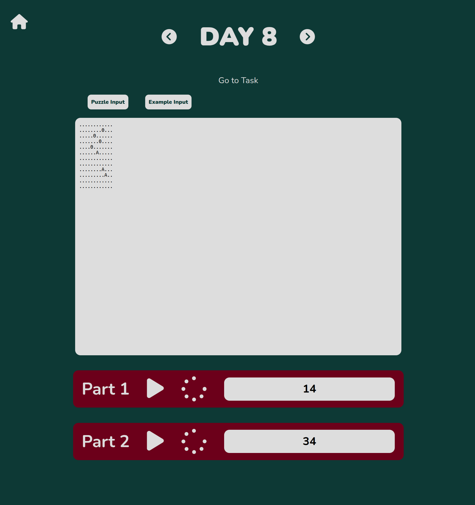

# Advent of Code 2024 Solutions

This repository contains my solutions for [Advent of Code 2024](https://adventofcode.com/2024), implemented using **React** and **JavaScript**.

I used this project to practice and learn JavaScript and React. I focused on functional programming and modern JavaScript features.

## Project Structure

- The components used to build the UI are in the `components` folder ([./src/Components](./src/Components)).
- Each day's solution is implemented in a separate JavaScript file in [./src/Script](./src/Script/).
- The project is managed with **NPM**.

## Getting Started

### Prerequisites
Make sure you have the following installed:
- [Node.js](https://nodejs.org/) (latest LTS version recommended)
- [NPM](https://www.npmjs.com/) (comes with Node.js)

### Installation
Clone the repository and install dependencies:
```sh
git clone git@github.com:swalstab/advent_of_code_2024.git
cd advent_of_code_2024
npm install
```

### Running the Project
To start the development server:
```sh
npm start
```

## Screenshots

### Home


### Day


